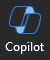

---
demo:
  title: 'Demo: Copilot di Word'
---

[Kembali ke Indeks](https://microsoftlearning.github.io/MS-4012-Microsoft-Copilot-Web-Based-Interactive-Experience-for-Executives/)

# Microsoft 365 Copilot di Word

## Persiapan Demo

Contoh dokumen dapat ditemukan di repositori GitHub MS-4012 [di sini](https://github.com/MicrosoftLearning/MS-4012-Microsoft-Copilot-Unlocked/tree/master/Resourcefiles).

Berkas tertentu yang digunakan dalam latihan ini adalah:

- [**ContosoLearn App Overview.docx**](https://github.com/MicrosoftLearning/MS-4012-Microsoft-Copilot-Unlocked/raw/master/Resourcefiles/ContosoLearn%20App%20Overview.docx)
- [**ContosoLearn Competitor SWOT.docx**](https://github.com/MicrosoftLearning/MS-4012-Microsoft-Copilot-Unlocked/raw/master/Resourcefiles/ContosoLearn%20Competitor%20SWOT.docx)
- [**ContosoLearn Value Proposition.docx**](https://github.com/MicrosoftLearning/MS-4012-Microsoft-Copilot-Unlocked/raw/master/Resourcefiles/ContosoLearn%20Value%20Proposition.docx)
- (Opsional - lihat petunjuk di bawah) [**Panggilan Konferensi Laba Kuartal Kedua Microsoft FY24**](https://github.com/MicrosoftLearning/MS-4012-Microsoft-Copilot-Unlocked/raw/master/Resourcefiles/Microsoft_FY24_Second_Quarter_Earnings_Conference_Call.docx) 

> **CATATAN:** Diperlukan waktu hingga 10 menit untuk menyinkronkan berkas-berkas ini ke OneDrive Anda. Untuk mempercepat proses ini, Anda dapat membuka dokumen lalu menutupnya, yang akan menambahkannya ke daftar Paling Baru Digunakan (Most Recently Used, MRU).

## Poin Pembicaraan

Dalam Pengalaman Interaktif, kami menyusun gagasan baru untuk aplikasi atau layanan, menciptakan identitas merek dan aset pemasaran, serta menganalisis prospek persaingan. Namun bagaimana kita bisa melangkah lebih jauh?

Dengan Copilot di Word, kita dapat mengubah proses pembuatan dan penyempurnaan dokumen, sehingga memungkinkan Anda membuat konten yang menarik dengan mudah.

Dalam demo ini, kami akan mengambil dokumen yang baru saja kami buat dan mengubahnya bersama-sama untuk membuat laporan analisis strategi. Selain itu, kami akan menyesuaikan format dan nada untuk memastikan konten selaras dengan tujuan kami.

## Langkah Demo

1. Luncurkan Microsoft Word baik di desktop atau dengan mengetik **Word.new** di tab Edge baru.
1. Klik isi dokumen dan pilih **ikon Copilot** yang ditampilkan.

    

1. Di Word, jendela **Draf dengan Copilot** sekarang akan ditampilkan. Di bidang perintah, masukkan perintah berikut:

    ```text
    Create a comprehensive strategic analysis report for ContosoLearn using the following files as references: /ContosoLearn App Overview, /ContosoLearn Competitor SWOT, and /ContosoLearn Value Proposition. The strategic analysis report should include the following sections:
        
    Executive Summary
    App Overview
    Market Research
    Competitor SWOT Analysis
    Value Proposition
    Conclusion
    ```

    > **PENTING:**  Anda harus mengetik ulang "/" dan memilih file yang benar dari daftar Paling Baru Digunakan (MRU) agar ini berfungsi dengan baik.

1. Copilot sekarang akan menghasilkan draf laporan analisis strategis berdasarkan perintah yang Anda berikan. Setelah Copilot selesai, jendela prompt berikut akan ditampilkan:

    
    
    Masukkan hal berikut ini di bidang Isi:

    ```text
    Remove the "Market Research" section and add a "Competitive Landscape" section. Ensure the content is concise and aligns with the overall tone of the document.
    ```

    > **CATATAN:** Jika Copilot untuk Word tidak bekerja untuk Anda, Anda bisa menggunakan tautan berikut untuk mengakses dokumen yang dihasilkan: [**ContosoLearn Contoh Output Word **](https://github.com/MicrosoftLearning/MS-4012-Microsoft-Copilot-Unlocked/raw/master/Resourcefiles/ContosoLearn%20Example%20Word%20Output%20(not%20to%20be%20used).docx).

## Langkah-langkah Demo Opsional

### Meringkas dokumen besar

1. Unduh dan buka file berikut di Word di desktop Anda: [**Panggilan Konferensi Penghasilan Kuartal Kedua Microsoft FY24**](https://github.com/MicrosoftLearning/MS-4012-Microsoft-Copilot-Unlocked/raw/master/Resourcefiles/Microsoft_FY24_Second_Quarter_Earnings_Conference_Call.docx).
1. Di dalam Word, pada pita, pilih **ikon Copilot**.

    

1. Di bidang **Tanyakan apa pun tentang dokumen ini**, salin dan tempel perintah atau ketik: 

    ```text
    Based on the document, how did AI impact Microsoft's earnings this year?
    ```

1. Pilih **Kirim**.  
1. Di bidang **Tanyakan apa pun tentang dokumen ini**, salin dan tempel perintah atau ketik: 

    ```text
    Copilot, generate a FAQ based on this document.
    ```
    
1. Pilih **Kirim**.

[Kembali ke Indeks](https://microsoftlearning.github.io/MS-4012-Microsoft-Copilot-Web-Based-Interactive-Experience-for-Executives/)
