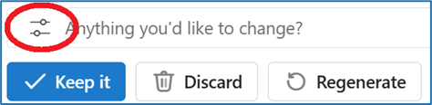

---
demo:
  title: 'Demo: Copilot di Outlook'
---

[Kembali ke Indeks](https://microsoftlearning.github.io/MS-4012-Microsoft-Copilot-Web-Based-Interactive-Experience-for-Executives/)

# Microsoft 365 Copilot di Outlook

## Persiapan Demo

Petunjuk untuk pengaturan ini dapat ditemukan [di sini](https://microsoft.seismic.com/Link/Content/DCFPQWmT2DMXC8WJjgjP4H44GWXG). Secara khusus, halaman 1-4, yang mencakup cara menyiapkan utas email yang akan kami referensikan dalam demo di bawah ini.

> **PENTING:**  Penyiapan demo akan memerlukan setidaknya 4 orang (6 secara opsional). Lakukan ini bersama tim Anda sebelum penyampaian yang direncanakan. Setelah selesai, Anda dapat mereferensikan email ini untuk pengiriman di masa mendatang.

## Poin Pembicaraan

"Mari kita lihat utas email. Ini adalah diskusi fiktif di mana tim saya berbicara tentang sebuah postingan blog penting tentang Copilot. Ini mungkin terlihat seperti utas email yang Anda lihat setiap hari.

Ketika saya memilih tombol Ringkasan oleh Copilot, Copilot meringkas utas untuk saya dan memberi saya poin yang paling relevan.

Itu cukup berguna. Saya memiliki utas email panjang yang tiba di kotak masuk saya sepanjang waktu, dan itu bisa menjadi tugas untuk menguraikan apa yang penting dan apa yang tidak.

Aku akan membalas, dan aku akan menggunakan Copilot untuk membantuku. Kita dapat melihat bahwa Copilot telah menghasilkan beberapa perintah yang disarankan karena Copilot telah membaca utas email dan memiliki pemahaman tentang konteks dan bagaimana saya mungkin ingin membalas.

Ini berguna, tetapi balasan ini memerlukan perintah kustom. Saya juga dapat mengedit perintah ini untuk menyesuaikan nada dan panjang balasan.

Ketika saya memilih 'Bernada seperti saya,' Copilot melihat email keluar saya dan memastikan bahwa responsnya sesuai dengan gaya komunikasi pribadi saya. Mari kita gunakan itu.

Ini cukup bagus, tapi saya pikir itu bisa lebih baik. Hasil copilot didasarkan, sebagian, pada kualitas pertanyaan yang diajukan.

OK, saya akan menyimpan respons ini."

## Langkah Demo

1. Beralih ke Outlook dengan utas email demo yang terbuka.

    > **PENTING:**  Jangan tampilkan email apa pun yang berisi data rahasia.

1. Di bawah subjek email, pilih **Ringkasan oleh Copilot** dan tunjukkan hasilnya.
1. Di bagian atas halaman, pilih **Balas semua**.
1. Di bagian bawah bidang email baru, tunjukkan bagian **Draf dengan Copilot** dan perintah yang disarankan.
1. Pilih **Kustom**.

    


1. Di bidang **Apa yang ingin Anda tulis dalam email**, salin dan tempel perintah atau ketik: 

    ```text
    Approve and thank the team--be warm! They worked hard. And be a little funny if you can.
    ```

1. Pilih tombol **Edit perintah**.

    

1. Pilih **Bernada seperti saya**.
1. Pilih **Hasilkan**.
1. Pilih **Ada yang ingin Anda ubah?** Kotak teks.
1. Salin dan tempel perintah atau ketik: 

    ```text
    Can you make a that a bit longer? It's just a little bit too short.
    ```

1. Pilih tombol **Hasilkan**.  
1. **Opsional**: Di **Ada yang ingin Anda ubah?** Kotak teks, ketik **"Buat lebih lucu"** lalu pilih Hasilkan.
1. Pilih **Simpan**.

    > **CATATAN:**  Jangan kirim balasan, karena Anda mungkin ingin menggunakan kembali utas email ini untuk demo mendatang.

[Kembali ke Indeks](https://microsoftlearning.github.io/MS-4012-Microsoft-Copilot-Web-Based-Interactive-Experience-for-Executives/)
