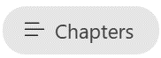

---
demo:
  title: 'Demo: Copilot di Teams'
---

[Kembali ke Indeks](https://microsoftlearning.github.io/MS-4012-Microsoft-Copilot-Web-Based-Interactive-Experience-for-Executives/)

# Microsoft 365 Copilot di Teams

## Persiapan Demo

Untuk memastikan demo yang lancar, pilih salah satu opsi pengaturan berikut ini:

**Opsi A: Rekap Rapat**

Petunjuk untuk pengaturan ini dapat ditemukan [di sini](https://microsoft.seismic.com/Link/Content/DCFPQWmT2DMXC8WJjgjP4H44GWXG). Secara khusus, lihat halaman 5-10, yang membahas cara mengatur rapat Teams (Project Avalon) yang akan kita lihat dalam demo di bawah ini.

> **PENTING**:
> - Pengaturan demo Opsi A akan memerlukan setidaknya 4 orang (bisa juga 6).
> - Lakukan ini bersama tim Anda sebelum penyampaian yang direncanakan.
> - Setelah selesai, Anda dapat merujuk rapat Teams ini untuk penyampaian di masa mendatang.
> - Jika Anda tidak dapat melakukan pekerjaan persiapan karena alasan apa pun, lihat demo Opsi B.

**Opsi B: Obrolan Teams**

Opsi demo ini sengaja tidak memerlukan pengaturan sebelumnya. Namun, Anda harus memanfaatkan salah satu utas Obrolan Teams Anda sendiri yang sudah ada sebelumnya. Pastikan bahwa tidak ada informasi rahasia yang dibagikan dalam obrolan ini sebelum menggunakannya untuk demo Anda.


## Opsi A - Demo Rekap Rapat

### Poin Pembicaraan

"Sekarang, saya akan menunjukkan kepada Anda apa yang kami sebut rekap rapat di Teams.

Berikut ini rapat antara saya dan rekan-rekan saya. Kami tidak dapat menunjukkan rapat asli kami karena alasan kerahasiaan, tetapi berikut adalah rapat fiktif yang saya rekam bersama tim saya di mana kami membahas peluncuran produk fiktif bernama Project Avalon.

Rekap didasarkan pada transkripsi rekaman. Ini menunjukkan siapa yang terlibat dan kapan mereka berbicara. Ada juga ringkasan tentang apa yang kita bicarakan. Copilot telah mengatur rapat saya berdasarkan bagian untuk mempermudah menemukan apa yang saya cari.

Sekarang saya dapat mengajukan pertanyaan kepada Copilot dan mendapatkan lebih banyak informasi tentang rapat ini. Misalnya, mari kita lihat apa yang dibahas dan apa item tindakan untuk setiap orang."

### Langkah-langkah demo

1. Pindah ke tab browser dengan Microsoft Teams terbuka ke rapat **peluncuran Project Avalon**.

    > **PENTING:**  Jangan tampilkan rapat atau obrolan apa pun yang berisi data rahasia.

1. Pilih tab **Rekap**.

    

1. Tunjukkan **Speaker**.
1. Pilih **Topik**.

    

1. Pilih **Bab**.

    

1. Di pojok kanan atas, pilih **Copilot**.

    

1. Dalam kotak teks **Tanyakan apa pun tentang rapat ini**, salin dan tempel perintah:

    ```text
    Can you list action items and owners in a table?
    ```

1. Pilih **Kirim**.
1. Dalam kotak teks **Tanyakan apa pun tentang rapat ini**, salin dan tempel perintah: 

    ```text
    Did anyone strongly oppose the decision, and how do you know?
    ```
    
1. Pilih **Kirim**.
1. Dalam kotak teks **Tanyakan apa pun tentang rapat ini**, salin dan tempel perintah:

    ```text
    Based on the transcript, when would you recommend we launch the product and why?
    ```

1. Pilih **Kirim**.

## Opsi B - Obrolan Teams

### Poin Pembicaraan

"Sekarang, saya akan menunjukkan kepada Anda bagaimana Copilot dapat meningkatkan pengalaman Obrolan Teams kami.

Berikut ini utas obrolan antara saya dan rekan-rekan saya. Copilot membantu dengan merangkum sorotan dari obrolan kami, sehingga memudahkan untuk mengikuti poin-poin penting tanpa harus membaca setiap pesan.

Sekarang saya dapat mengajukan pertanyaan kepada Copilot untuk mendapatkan informasi yang lebih spesifik dari obrolan. Misalnya, mari kita cari tahu apa itu item terbuka dan bagaimana kita harus melanjutkan dengan langkah-langkah berikutnya.

Selain itu, saya dapat membuat draf balasan dan menggunakan Copilot untuk memperbaikinya, sehingga memastikan bahwa pesan saya jelas dan ringkas. Ini sangat berguna untuk memastikan komunikasi yang efektif dalam tim."

### Langkah-langkah demo

1. Temukan utas Obrolan Teams tempat Anda belum membagikan informasi rahasia apa pun. Pilih opsi **Buka obrolan di jendela baru**.

    

1. Dengan Obrolan Teams yang dibuka di jendela baru, pilih **Buka Copilot** di sudut kanan atas.

    

1. Di panel obrolan Copilot yang terbuka, pilih **Sorotan dari hari sebelumnya*** untuk melihat ringkasan cepat obrolan dari hari sebelumnya.

    

1. Dalam kotak teks **Ajukan pertanyaan tentang obrolan ini**, salin dan tempel perintah: 

    ```text
    What are the open items?
    ```
    > **Catatan:** Jangan ragu untuk memilih contoh perintah alternatif yang Anda yakini akan menargetkan audiens Anda dengan lebih baik.   

1. Di bawah riwayat obrolan, di kotak teks **Ketik pesan**, mulai ketik balasan. **Jangan tekan kirim dulu.**

1. Dengan draf balasan Anda, pilih Copilot dari kotak teks **Ketik pesan** .

       

1. Cobalah opsi Copilot **Tulis Ulang** dan **Sesuaikan** untuk lebih menunjukkan kemampuan Copilot.

         

[Kembali ke Indeks](https://microsoftlearning.github.io/MS-4012-Microsoft-Copilot-Web-Based-Interactive-Experience-for-Executives/)
