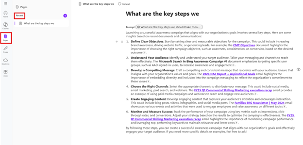
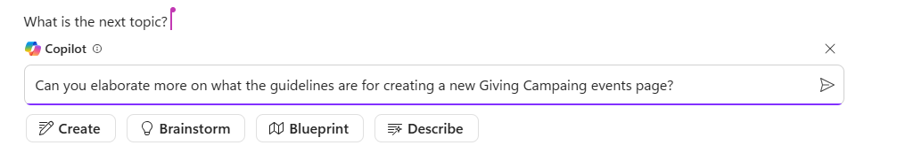

---
demo:
  title: 'Demo: Obrolan Bisnis & Halaman'
---

[Kembali ke Indeks](https://microsoftlearning.github.io/MS-4012-Microsoft-Copilot-Web-Based-Interactive-Experience-for-Executives/)

# Demo BizChat (Seluler & PC)

## Langkah-langkah Demo Seluler BizChat

1. Luncurkan Copilot di perangkat Seluler Anda.

1. Pastikan **Tab Kerja** dipilih.

1. Ketik atau gunakan suara Anda untuk memasukkan perintah berikut:

   ```text
   can you find me any emails from earlier today from my colleague [colleagues name] and list up any action items
   ```
1. Sebagai contoh, Anda dapat menggunakan:

   ```text
   summarize the info you have on <Customer XYZ> in my calendar for this week
   ```

## Langkah-langkah Demo Aplikasi BizChat di Microsoft 365

1. Luncurkan BizChat dengan menavigasi ke [m365.cloud.microsoft/chat](https://m365.cloud.microsoft/chat).

1. Dengan BizChat terbuka, pastikan tab Kerja dipilih.

    

1. Ketik perintah berikut:

    ```text
    What are the key steps we should take to launch a successful Giving Campaign within our company?
    ```

1. Selanjutnya, ekspor respons ke **Halaman** dengan memilih **Edit di Halaman**:

    

1. Selanjutnya, label sensitivitas pajangan dapat diatur dalam halaman:

    

1. Sekarang, Anda dapat menunjukkan di mana halaman dapat diakses. ada dua opsi:

    - akses dari aplikasi Halaman itu sendiri (disinkronkan secara otomatis):

        

    - akses dari dalam Loop, di bawah **Komponen dan ide terbaru**:

        

1. Navigasi kembali ke tab Halaman yang terbuka tempat Halaman masih ditampilkan (https://m365.cloud.microsoft/pages).

1. Lanjutkan bekerja dengan halaman dengan mengetikkan perintah berikut:

     ```text
     Can you elaborate more on what the guidelines are for creating a new Giving Campaing events page?
     ```

     

1. Di bagian bawah halaman, ketik simbol a-keong (**@**). Ini membuka menu konteks untuk menelusuri orang, file, rapat, dan lainnya:

1. Tambahkan salah satu kolega Anda dari daftar orang.

1. Setelah menambahkan kolega Anda, klik namanya untuk memberi mereka akses. Mereka akan menerima pemberitahuan email dengan tautan untuk berkolaborasi di Halaman:

    

1. Setelah kolega Anda memiliki akses, mereka bebas untuk terus mengerjakan halaman melalui Outlook, halaman, atau loop. 


[Kembali ke Indeks](https://microsoftlearning.github.io/MS-4012-Microsoft-Copilot-Web-Based-Interactive-Experience-for-Executives/)
